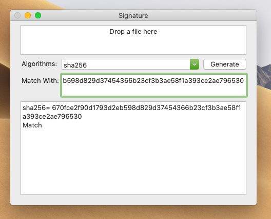

# Signature

A little GUI application to generate digest of a file.

* gost-mac
* md4
* md5
* md_gost94
* ripemd160
* sha
* sha1
* sha224
* sha256
* sha384
* sha512
* streebog256
* streebog512
* whirlpool

